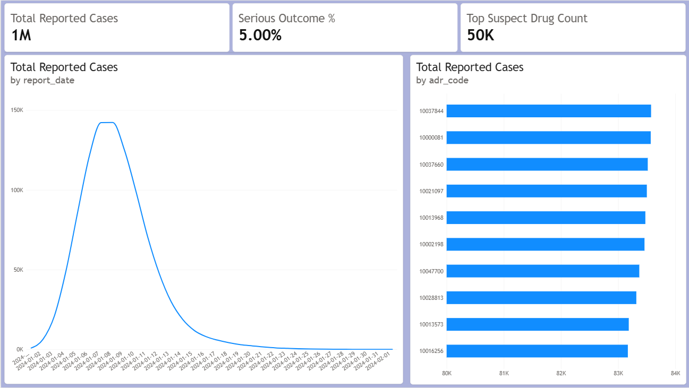
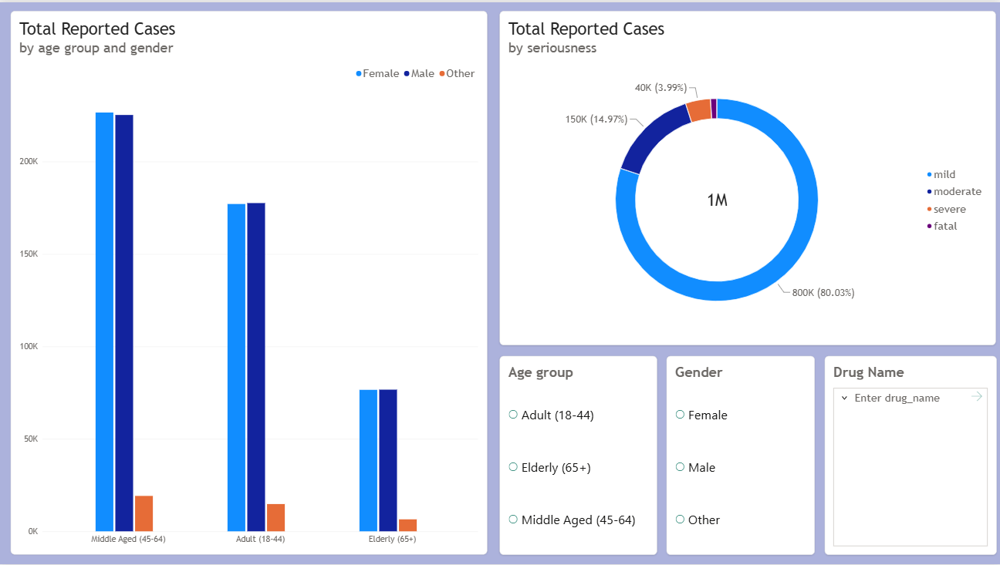

# Pharmacovigilance ADR Surveillance Dashboard

## Project Overview
This project presents an end-to-end Pharmacovigilance Adverse Event Reporting System (ADR) surveillance dashboard analyzing 1,000,000 post-market safety records. The pipeline processes raw adverse report logs, standardizes brand-to-generic drug entities using SQL, models relationships in Power BI, and visualizes trends across patient demographics and outcome severity levels.

---

## Key Safety Findings
- **Total Case Volume:** 1,000,000 unique adverse event reports analyzed.
- **Serious Outcome Baseline:** 5.00% baseline rate for severe or fatal outcomes across all reported events.
- **Top Suspect Drugs:** Standardized entity mapping highlights high-volume reporting across core therapies including Semaglutide, Metformin, and Atorvastatin.
- **Demographic Vulnerability:** Adult (18–44) and Middle-Aged (45–64) populations account for the largest proportion of submitted case reports.

---

## Technical Pipeline & Architecture

### 1. SQL Database Setup & ETL Cleaning
- Formed a normalized **Star Schema** consisting of `Fact_ADR_Reports`, `Dim_Patients`, `Dim_Drugs`, and `Dim_Events`.
- Mapped brand names to standardized generic drug entities using conditional SQL logic (`CASE WHEN`).
- Synthesized dynamic chronological report timelines (`report_date`) using event onset data (`onset_days`).
- Binned continuous patient ages into clinical demographic groups (`age_group`).

### 2. Power BI Data Modeling & DAX Measures
- Established single-direction 1-to-Many ($1:\text{*}$) relationships connecting dimension tables to the central fact table.
- Set explicit field summarization settings to prevent numerical auto-aggregation on ID keys.
- Authored key DAX metrics:
  - `Total Reported Cases` = `DISTINCTCOUNT(Fact_ADR_Reports[report_id])`
  - `Serious Outcome %` = `DIVIDE([Serious Cases Count], [Total Reported Cases], 0)`
  - `Top Suspect Drug Count` = `MAXX(TOPN(1, VALUES(Dim_Drugs[drug_name]), [Total Reported Cases], DESC), [Total Reported Cases])`

---

## Dashboard Visualizations

### Page 1: Executive Summary

- **KPI Header:** Tracks total reported cases, serious outcome percentage, and top suspect drug case count.
- **Adverse Event Volume Over Time:** Line chart evaluating chronological report volume.
- **Top 10 MedDRA Side Effects:** Horizontal bar chart highlighting the top 10 reaction codes.

### Page 2: Demographic & Outcome Breakdown

- **Outcome Severity Breakdown:** Donut chart categorizing reports by severity.
- **Demographic Distribution:** Clustered column chart comparing age groups and gender distribution.
- **Interactive Slicers:** Dropdown filters for Drug Name, Gender, and Age Group.
